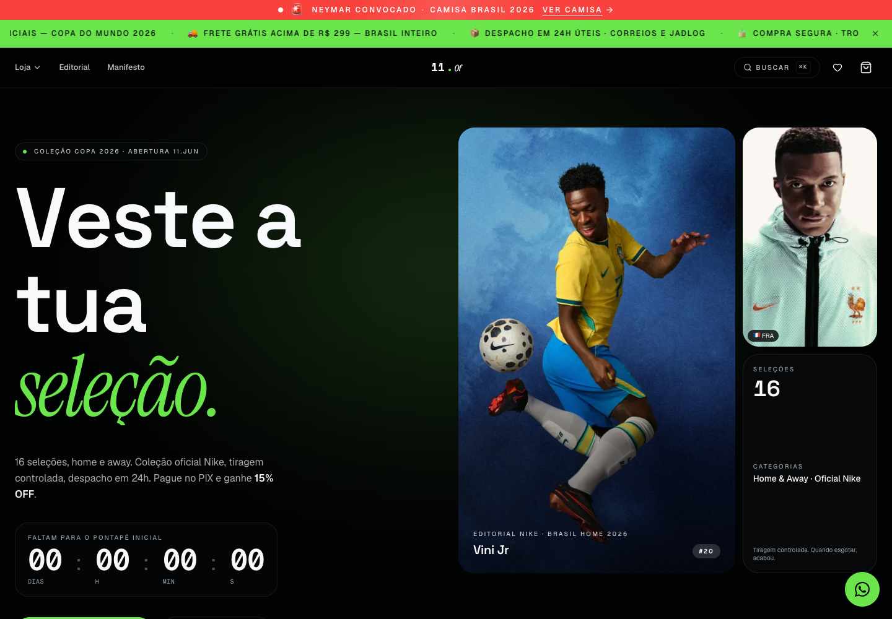

# 11 Of

**An editorial football jersey storefront built for Brazilian commerce.**

11 Of combines a product catalog, immersive team editorials and a PIX checkout in a custom Next.js application. Dark surfaces, oversized typography, a green accent and motion carry one visual identity from discovery to the order page.

[Explore the storefront](https://loja-theta-plum.vercel.app) · [Application source](./src) · [Engineering context](./llms.txt)



*Public storefront preview. Third-party product imagery retains its original ownership.*

## Product experience

- **Discovery:** catalog filters, product search, team collections and dedicated editorial pages.
- **Product detail:** product and editorial galleries, size selection, a fit calculator and jersey personalization.
- **Shopping:** a cart drawer, favorites, recently viewed items and a dedicated checkout layout.
- **Brazilian checkout:** CPF and postal-code validation, BRL pricing, shipping estimates and PIX payment presentation.
- **Order operations:** order status, delivery tracking views, stock notification requests and an admin delivery interface.

The storefront is public. Reproducing the complete checkout requires a compatible Supabase database and a configured payment account; the repository does not include database migrations or seeds. The public site is a visual reference, not a payment sandbox.

## Engineering

| Layer | Implementation |
| --- | --- |
| Application | Next.js 16.2.4 App Router, React 19.2.4, TypeScript |
| Interface | Tailwind CSS 4, shadcn/ui and Radix primitives, Lucide icons |
| Motion | GSAP and ScrollTrigger |
| Data | Supabase Postgres, SSR clients and storage image delivery |
| Payments | Server-side PagNet Brasil client and a transaction reconciliation webhook |
| Cart | HMAC-signed HTTP-only cookie with bounded line counts and quantities |

Prices remain integer cents throughout the data model and PagNet request builder. Checkout resolves product variants on the server, requests stock reservations through database RPCs, records order snapshots and then creates a PIX charge. The webhook retrieves the transaction from PagNet before applying payment state changes.

```text
src/
├── app/
│   ├── (loja)/                 Storefront, catalog, editorial and favorites
│   ├── checkout/               Dedicated checkout layout
│   ├── pedido/[id]/            Payment and delivery status
│   ├── admin/                  Order and delivery administration
│   ├── _actions/               Cart, checkout, PIX and delivery mutations
│   └── api/webhooks/pagnet/    Payment reconciliation endpoint
├── components/
│   ├── loja/                   Storefront components and animations
│   ├── admin/                  Admin components
│   └── ui/                     Shared interface primitives
└── lib/
    ├── catalog.ts              Product queries and cart resolution
    ├── cart.ts                 Signed cart serialization
    ├── brand.ts                Brand, locale and pricing constants
    ├── pagnet/                 Server-only payment client
    └── supabase/               Browser and server data clients
```

## Local development

Use Node.js 20.9 or newer and npm.

```bash
git clone https://github.com/Vinizeira13/11-of.git
cd 11-of
npm ci
cp .env.example .env.local
```

Configure the variables below, provision the database contract described in [llms.txt](./llms.txt), then start the app:

```bash
npm run dev
```

Open [localhost:3000](http://localhost:3000). An empty Supabase project is insufficient: the catalog expects existing tables, and checkout depends on database functions that are not distributed here.

### Configuration

| Variable | Purpose |
| --- | --- |
| `NEXT_PUBLIC_SUPABASE_URL` | Supabase project endpoint |
| `NEXT_PUBLIC_SUPABASE_ANON_KEY` | Public client key; database access depends on its grants and policies |
| `NEXT_PUBLIC_SITE_URL` | Canonical origin for metadata, links and payment callbacks |
| `CART_SECRET` | Server-only cart signing secret; at least 32 characters in production |
| `PAGNET_PUBLIC_KEY` | PagNet credential used by the server client |
| `PAGNET_SECRET_KEY` | PagNet secret used by the server client |
| `PAGNET_API_BASE` | Optional payment API endpoint override |
| `ADMIN_PASSWORD` | Enables the admin login when configured |
| `ADMIN_RPC_TOKEN` | Server-side token expected by the delivery update RPC |
| `BREAKING_NEWS_OFF` | Optional switch; `1` disables the breaking-news experience |

Keep payment and admin credentials server-side. The current source does not use the older `PAGUE_*` or `SUPABASE_SERVICE_ROLE_KEY` variables.

## Development commands

| Command | Purpose |
| --- | --- |
| `npm run dev` | Start the development server |
| `npm run build` | Create the production build |
| `npm run start` | Serve an existing production build |
| `npm run lint` | Run ESLint |

## Integration status

- Without PagNet credentials, the payment client returns a mock charge. This is not a completed payment and still requires the database-backed order flow.
- The callback route is `/api/webhooks/pagnet`. It reconciles against the payment provider; it does not use the previous pague.dev HMAC contract.
- Database migrations, RPC definitions and access policies are not included. Review those in an isolated environment before enabling checkout or administration.
- Payment completion, refunds, retry behavior and fulfillment require end-to-end validation with the configured services.
- The interface is in Brazilian Portuguese. Brand assets, catalog content, contact details and commercial claims must be reviewed for any independent deployment.

## Credits and reuse

Built with Next.js, Supabase, GSAP, shadcn/ui and Radix. Football brands, team identities and product imagery belong to their respective owners. This repository does not include a standalone license file; confirm reuse rights before redistributing code or assets.
